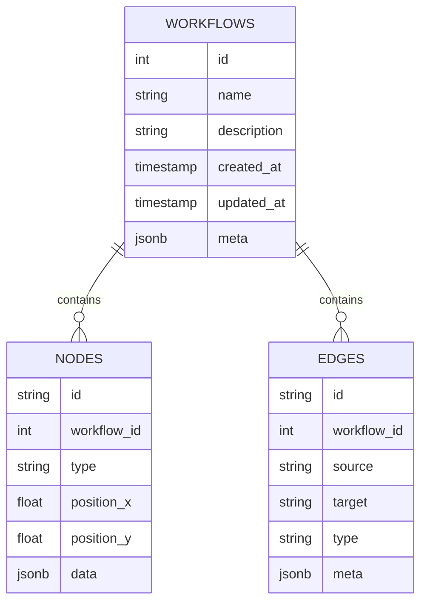
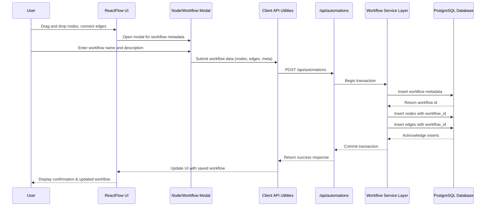

# Visual Automation Workflow Builder

## Overview

This project implements a simplified **visual automation workflow builder** where users can create automation flows by connecting nodes together using a drag-and-drop interface.

The application allows users to:

- Create workflows visually using a node-based editor
- Connect actions using edges to define execution flow
- Edit node properties using a modal interface
- Create workflows starting from a template
- Persist workflows, nodes, and edges to a database
- Load and edit previously saved workflows
- Delete existing workflows

The implementation uses **ReactFlow for the visual editor**, **Next.js API routes for backend endpoints**, and **PostgreSQL for data persistence**.

---

# Tech Stack

## Frontend
- Next.js (App Router)
- ReactFlow
- TypeScript
- CSS Modules

## Backend
- Next.js API Routes
- PostgreSQL

## Testing
- Jest

---

# Architecture

The application follows a simple full-stack architecture:

```
ReactFlow UI
      ↓
Next.js API Routes
      ↓
PostgreSQL Database
```

### Frontend
- Handles the automation workflow builder using ReactFlow.
- Manages node and edge state.
- Provides UI components such as modals, sidebar, and panels.

### Backend
- API routes handle CRUD operations for workflows.
- Server-side utilities manage database queries and transaction handling.

### Database
- PostgreSQL stores:
  - workflows
  - nodes
  - edges

---

# Features Implemented

## Node Creation and Editing

- Nodes can be added via drag-and-drop from the sidebar.
- A modal opens when:
  - a node is dropped onto the canvas
  - a node is clicked or double-clicked
- Users can edit node properties such as label and custom fields.
- Node changes persist in the workflow state.

---

## UI / UX Improvements

Several improvements were made to enhance usability:

- Responsive sidebar
- Collapsible panels
- Improved node styling
- Fit view on node add or drag
- Keyboard shortcut for node deletion
- Right panel to manage workflows
- Modal-based workflow saving
- Ability to start from predefined templates

---

# Bonus Features Implemented

Additional functionality was added beyond the base requirements:

- Multiple node types:
  - Start
  - Webhook
  - Email
  - Condition
  - End
- Export workflow as JSON
- Workflow templates
- Panel node library
- Live node update when deleting nodes
- Node label validation for node properties
- Responsive layout
- Collapsible workflow panel

Potential improvements that could be added later:

- Module based styling for cleaner code
- Form validations for other node properties
- Live node update when deleting nodes
- Undo/redo functionality
- Workflow validations
- Keyboard shortcuts for more actions
- Dark/light theme toggle

---

# Database Setup

## Database Schema
A very simple schema was designed to support the basic workflow functionalities:



---

## Database Initialization

A SQL script is included(sent over email) to create the required tables.

Run the script to create:
- workflows
- nodes
- edges

---

## Environment Variables

Create a `.env` file based on the example below or rename .env.example to .env.

```
PG_USER=postgres
PG_PASSWORD=yourpassword
PG_HOST=localhost
PG_DATABASE=workflow_db
PG_PORT=5432
```

---

# Installation

## Prerequisites

- Node.js 22
- PostgreSQL

Use the correct Node version:

```
nvm use
```

Install dependencies:

```
npm install
```

Start the development server:

```
npm run dev
```

Open the application at:

```
http://localhost:3000
```

---

# Health Check

A health endpoint is available to verify the database connection.

Endpoint:

```
GET /api/health
```

Example response:

```
{
  "status": "ok",
  "database": "connected",
  "timestamp": "2026-03-13T12:50:28.861Z"
}
```

Access it at:

```
http://localhost:3000/api/health
```

---

# API Documentation

## Create Workflow

```
POST /api/automations
```

Request Body:

```
{
  "name": "Condition Workflow",
  "description": "Email workflow with condition",
  "nodes": [...],
  "edges": [...]
}
```

Response:

```
{
  "success": true
}
```

---

## Get All Workflows

```
GET /api/automations
```

Response:

```
[
  {
    "id": 34,
    "name": "Condition Workflow",
    "description": "Email workflow with condition",
    "created_at": "...",
    "updated_at": "...",
    "meta": {}
  }
]
```

---

## Get Workflow by ID

```
GET /api/automations/:id
```

Returns the workflow along with all nodes and edges.

Response structure:

```
{
  "name": "Condition Workflow",
  "description": "Email workflow with condition",
  "nodes": [...],
  "edges": [...]
}
```

---

## Update Workflow

```
PUT /api/automations/:id
```

Request body is the same as the create endpoint.

```
{
  "name": "...",
  "description": "...",
  "nodes": [...],
  "edges": [...]
}
```

Response:

```
{
  "success": true
}
```

---

## Delete Workflow

```
DELETE /api/automations/:id
```

Response:

```
{
  "success": true
}
```

---

# Dependencies and Reasoning

## pg

The `pg` library was used as the PostgreSQL client.

Reasons:
- Lightweight and widely used PostgreSQL driver
- Provides full control over SQL queries
- Supports transactions easily
- Suitable for small backend layers without requiring a full ORM

## react-icons

Used for UI iconography.

Reasons:
- Lightweight
- Easy integration with React
- Provides consistent icon sets for UI components

---

# Trade-offs and Design Decisions

### PostgreSQL vs MongoDB

PostgreSQL was chosen because workflows have **relational structure**:

- workflows
- nodes
- edges

This structure maps well to relational tables and allows easy querying and transactional updates.

---

### Using `pg` instead of Prisma

While Prisma provides a powerful ORM, using `pg` offers:

- Simpler setup
- Direct SQL control
- Better transparency for a small project

For a larger production system, Prisma or another ORM could improve maintainability.

---

### Styling Approach

Simple CSS modules were used instead of larger frameworks such as Tailwind or Bootstrap.

Reasoning:

- Avoid introducing unnecessary dependencies
- Maintain simplicity for a small timeframe
- Allow focused UI improvements without heavy styling frameworks

---

### Backend Structure

Next.js API routes were used for backend logic instead of a separate service.

Alternative considered:

- Separate backend service using FastAPI

However, keeping API routes inside Next.js simplifies development and deployment for this challenge.

---

# Project Structure

Example structure:

```
app/
  api/
    automations/
    health/

components/
  node/
    BaseNode
    index
  AutomationBuilder
  NodeModal
  Sidebar
  WorkflowPanel

lib/
  db.ts
  queries/
    oteries
  
services/
  nodeService
  dndService
  workflowService

tests/
```

---
# Testing

## Running Tests

To run the test suite:

```bash
npm test
```

## Current Testing Strategy

Due to time constraints, testing focused primarily on **core workflow functionality**.

The current test coverage includes a mix of:

- **Client-side tests** for UI and workflow behavior
- **Server-side tests** for API route logic
- **Workflow action tests** for critical actions such as saving and updating workflows

These tests ensure that the main interactions between the UI, API, and database behave correctly for the most common operations.

## Future Testing Strategy

Given more time, testing could be expanded to include **full workflow lifecycle tests** based on interaction flows between the UI, API layer, and database.

For example, the **workflow creation process** can be tested using the following interaction flow:



Additional testing areas might include:
- Updating an existing workflow
- Workflow validation scenarios
- Node property validation
- Edge connection validation
- API error handling
- Integration tests for API endpoints
- End-to-end workflow execution tests

---
# Commit History

Development was organized into logical commits to reflect incremental improvements.

Major areas of work include:

- Node creation and editing
- UI/UX improvements
- New node types
- Workflow management: Save, Delete, Export
- Database integration
- API implementation
- Health check endpoint
- Testing setup

---

# Improvements With More Time

Given more time, the following improvements would be implemented:

- Workflow validation (detect cycles or invalid edges)
- Undo/redo support
- Dark/light theme switching
- Improved keyboard shortcuts
- Integration tests for API endpoints
- More comprehensive unit tests
- Pagination or search for workflows
- Better error feedback in the UI

---